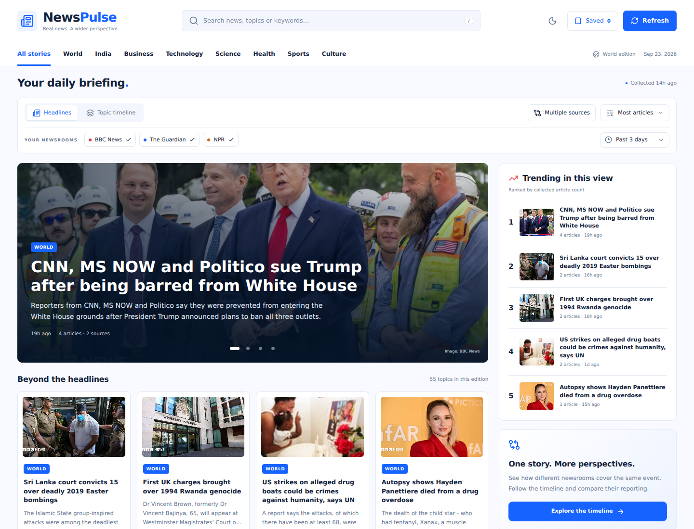

# News Pulse

A topic-clustered news timeline built for the Xponentium full-stack internship assessment.

Python collects news and groups related articles. A Node.js REST API serves the results. React combines a photo-led news homepage with an interactive topic timeline, source comparison, saved articles and a persistent light/dark theme.

**New to the stack? Start with [START_HERE_HINGLISH.md](START_HERE_HINGLISH.md).**



## Quick start

Requirements: **Node.js 24+**, **Python 3.11+** (verified with Node 24 and Python 3.12).

```sh
npm ci
npm run setup
npm run dev
```

Open http://localhost:5173 and click **Refresh**. The first collection can take several minutes. Local development needs no database account, API key, paid AI service or manually activated Python environment. In Windows PowerShell, use `npm.cmd` instead of `npm` if script execution is blocked. Finish `npm.cmd run setup` successfully before collecting news; it installs `feedparser` and the other Python dependencies into the project's environment.

## Reader features

- **Headlines:** featured stories with manual slide controls, publisher photos, article cards and a trending sidebar. Trending means most collected articles in the current view, not global popularity.
- **Search and categories:** search topic labels/keywords, choose a category, sort by coverage or recency, or keep only topics collected from multiple sources. Category labels use simple headline/keyword rules and can be imperfect; they are not publisher-assigned labels.
- **Topic timeline:** original time-axis visualization and chronological details remain one tab away. Clicking a headline selects its topic in this view.
- **Compare sources:** see original headlines and summaries side by side for the selected topic. An empty source column means no matching article was collected in the selected window. This is not a fact-check or bias score.
- **Saved articles:** bookmark up to 200 articles and search them later. Titles, summaries and links are stored in this browser's local storage; clearing browser data removes them. There is no account sync or full-article offline download.
- **Light/dark mode:** remembers your choice in this browser. Press `/` to focus search. Controls work with a keyboard and respect reduced-motion preferences.
- **Refresh feedback:** progress polling, visible errors and a cooldown countdown; an early retry keeps the original collection error visible.

Photos come from approved publisher image hosts in RSS or article Open Graph metadata. Missing or blocked photos use a graphic fallback. The design does not require an image API key. Existing SQLite/PostgreSQL schemas automatically gain the optional `image_url` field when opened; existing rows can receive feed photos on later collections.

Production locally:

```sh
npm run build
npm start
```

Open http://localhost:3001. Node serves both the built React app and the API.

Alternatively, if Docker is installed: `docker compose up --build`. Open port 3001. The named volume retains SQLite data across container restarts.

## Project layout

- `/scraper`: Python RSS normalization, full-text extraction, grouping, persistence.
- `/backend`: Express REST endpoints and asynchronous Python job orchestration.
- `/frontend`: React + Vite; responsive news homepage, timeline and article explorer.
- `/shared`: source configuration and the common database schema.
- `/tests`: deterministic Python tests and Node/Python integration checks.
- `/docs`: deployment, API reference, video script, requirement checklist and validation notes.

## Architecture and data flow

1. The browser calls `POST /ingest/trigger` and immediately gets a job ID (`202`).
2. Node starts Python as a subprocess without a shell. The server keeps responding while Python works.
3. Python fetches three configured feeds, normalizes fields/dates, skips existing canonical URLs and downloads new articles' main text.
4. Python groups the retained corpus, then commits article membership, clusters and collection metadata in one database transaction.
5. Node stores progress and the final result in `ingest_jobs`. The browser polls the status endpoint and reloads the timeline after completion.

SQLite and its WAL journal work out of the box on one local server. Set `DATABASE_URL` to use PostgreSQL in both languages without changing application code. Keep one application instance: the subprocess manager and ingestion lock intentionally target a single-instance assessment deployment.

## News sources

| Outlet       | Public RSS feed                             |
| ------------ | ------------------------------------------- |
| BBC News     | https://feeds.bbci.co.uk/news/world/rss.xml |
| The Guardian | https://www.theguardian.com/world/rss       |
| NPR          | https://feeds.npr.org/1001/rss.xml          |

These are independent outlets with public English-language RSS feeds. URLs and allowed article domains live in `shared/sources.json`. The reader links to original reporting; content ownership stays with each publisher.

## Ingestion decisions

- `feedparser` handles RSS/Atom structures and inconsistent date formats. Summary falls back from `summary` to `description` to the first `content:encoded` value; HTML is converted to plain text.
- Dates are normalized to millisecond-precision UTC ISO strings. Missing/unusable dates use collection time with `date_estimated=1`, surfaced in the UI. Dates more than six hours in the future are treated as unusable.
- Article URLs lose fragments and known tracking parameters, while meaningful query parameters are preserved. A unique canonical URL prevents duplicate rows across reruns. Existing article pages are not re-fetched.
- `requests` applies connection/read timeouts, size limits and redirect limits. Both feed and article URLs must stay within their source's configured domains. User-supplied URLs are not accepted by the API.
- `trafilatura` extracts full main-body text for new articles. Extraction errors, access blocks and very short bodies retain the RSS summary instead; they do not crash the collection.
- One unavailable feed is recorded as a warning. If all feeds fail, the previous snapshot remains intact and the job fails visibly.
- Default limits: 30 entries per feed per run, 30-day retention, latest 1,500 retained articles, four concurrent article downloads. Old articles are pruned in the same transaction as regrouping. The eight-minute job timeout bounds server work.

## Topic grouping: keyword overlap

I chose a transparent keyword-overlap approach rather than an opaque model so its decisions can be inspected and explained without model hosting or training data.

1. Lowercase the headline and first 60 summary words, tokenize, remove common English stop words.
2. Process articles chronologically. Compare each candidate with the fixed first article (anchor) of each eligible cluster.
3. Require **at least three shared meaningful words**, **Jaccard similarity >= 0.25**, **at least one shared headline word**, and a **72-hour window** from the cluster's anchor. Use the higher of headline-only and headline-plus-summary similarity so different summaries do not dilute matching headlines.
4. Choose the qualifying cluster with the highest similarity, or start a singleton cluster.
5. Use a representative real headline as the label and keep up to five common keywords as context.

`Jaccard(A, B) = |A ∩ B| / |A ∪ B|`.

These are conservative starting parameters, checked on controlled examples of clearly related and unrelated stories. They are not a claimed accuracy benchmark. Raise the shared-word requirement or similarity threshold to reduce false merges; lower them to increase recall. The anchor rule avoids transitive drift where A resembles B and B resembles C but A and C describe different events.

Clusters have deterministic IDs derived from their first article. IDs stay stable for an unchanged corpus; late older articles, re-grouping or retention expiry can change them. A stale selection returns a clear 404 and the frontend can reload.

**Limitation:** keyword overlap misses paraphrases/synonyms and may group distinct events that share names and vocabulary. English tokenization is intentionally simple. There is no semantic cross-source event deduplication; separate outlet articles remain separate records. The straightforward comparison is O(n²) in the worst case, so the working set is bounded.

## Timeline behavior

The frontend uses an actual horizontal time axis: each topic's bar starts at its earliest article and ends at its latest. A single timestamp is a point marker. Article count controls emphasis, and a numeric count remains visible.

Source and time filters apply before timeline aggregation, so article counts and start/end times match the selected sources/window. A topic's label comes from its complete retained cluster, even if its representative article is filtered out. Cluster details show the same filtered articles in chronological order.

The axis fits the filtered data extent with padding; the time-range selector controls article inclusion. On narrow screens the chart scrolls inside its panel and article details stack below. Controls support keyboard interaction and reduced motion; loading, empty, partial-failure and error states are explicit.

## REST API

The required routes work both at the root and with an `/api` prefix. No login is required to read news.

| Method | Endpoint                | Purpose                                                                      |
| ------ | ----------------------- | ---------------------------------------------------------------------------- |
| GET    | `/clusters`             | Label, count, sources, earliest/latest time per topic                        |
| GET    | `/clusters/:id`         | Topic and chronological articles                                             |
| GET    | `/timeline`             | Plot-ready clusters with start, end, count, duration, intensity and metadata |
| POST   | `/ingest/trigger`       | Start Python collection; returns job ID                                      |
| GET    | `/ingest/status/:jobId` | Persistent running/completed/failed job state                                |
| GET    | `/sources`              | Configured feed list                                                         |
| GET    | `/health`               | Server and database readiness                                                |

See [docs/API.md](docs/API.md) for parameters, examples and error behavior.

## Configuration

`npm run setup` creates `.env` from `.env.example` only if it does not exist. Node and Python read the same environment. Hosting values override file values.

| Variable                   | Default / meaning                                                  |
| -------------------------- | ------------------------------------------------------------------ |
| `PORT`                     | `3001`                                                             |
| `DB_PATH`                  | `data/news.db`, relative to project root                           |
| `DATABASE_URL`             | Empty locally; PostgreSQL URL overrides SQLite when set            |
| `PYTHON_BIN`               | Auto-detected project `.venv` executable                           |
| `CORS_ORIGIN`              | `http://localhost:5173`; comma-separated exact frontend origins    |
| `AUTO_INGEST`              | `false`; `true` starts one background collection at server startup |
| `INGEST_COOLDOWN_SECONDS`  | `60`                                                               |
| `INGEST_TOKEN`             | Optional server-only refresh key; never expose as a Vite variable  |
| `MAX_ARTICLES_PER_FEED`    | `30`, maximum 100                                                  |
| `RETENTION_DAYS`           | `30`, maximum 90                                                   |
| `REQUEST_TIMEOUT_SECONDS`  | `25`; bounded to 3–30 seconds                                      |
| `ARTICLE_WORKERS`          | `4`, maximum 6                                                     |
| `CLUSTER_SIMILARITY`       | `0.25`                                                             |
| `CLUSTER_MIN_SHARED_WORDS` | `3`                                                                |
| `CLUSTER_WINDOW_HOURS`     | `72`                                                               |
| `VITE_API_BASE_URL`        | `/api`; only set to a public API URL for a split deployment        |

`INGEST_TOKEN` can restrict refreshes; it is entered through a password dialog and not persisted in browser storage. Without a token, collection is public, but concurrent requests and rapid retries are limited. Job state survives process restarts; interrupted jobs become failed and can be retried.

## Testing

```sh
npm test
npm run build
```

Tests use isolated temporary databases and controlled feed/article inputs. They cover malformed/missing dates, RSS vs Atom, canonical URL deduplication, approved image hosts, extraction fallbacks, schema upgrades, coherent grouping, idempotence, partial/total feed failures, transaction rollback, REST validation/filtering and a real Node-to-Python subprocess round trip with persisted job progress/results. They do not depend on the internet.

Live feeds can change or reject requests; deterministic tests and a successful build do not prove deployment availability. See `docs/VALIDATION.md` for the actual verification performed on this delivery.

## Offline sample preview

On an empty local database only:

```sh
npm run demo
npm run dev
```

This loads explicitly fictional sample articles and shows a **Sample preview** banner. It refuses to overwrite existing real news. A successful live refresh replaces sample records atomically. Do not submit sample data as a live-news demonstration.

## Deployment and submission

The ZIP also includes `Create_NewsPulse_30_Commits.mjs`, an optional helper that organizes this source snapshot into 30 commits using the requested historical dates, February 9–April 30, 2026, with 2–4 day gaps. Run it only in a fresh extracted folder, before `git init`; it refuses unrelated existing repositories and does not push. See the Windows guide for the commands. These are selected Git timestamps, not a record of when this implementation was developed. The helper itself is excluded from the generated history.

See [docs/DEPLOYMENT.md](docs/DEPLOYMENT.md). The simplest layout uses one Docker web service for Node, Python and the built React frontend, with a separate hosted PostgreSQL database. The same app URL serves the UI and its `/api` URL serves the API. This avoids an extra frontend deployment and CORS setup while satisfying the required technologies.

Required handoff: GitHub repository, live frontend URL, live backend/API URL, this README and a 2–3 minute walkthrough. The candidate must record the walkthrough themselves; [docs/VIDEO_SCRIPT.md](docs/VIDEO_SCRIPT.md) is a guide, not an already recorded video.

AI assistance was used to draft this implementation, tests and documentation, as permitted by the assessment. Review, run, adapt and understand the code before submission. Do not claim unverified deployment or work you cannot explain.

## Technical references

- Node SQLite API: https://nodejs.org/api/sqlite.html
- Feedparser: https://feedparser.readthedocs.io/en/latest/
- Trafilatura extraction: https://trafilatura.readthedocs.io/en/latest/usage-python.html
- Render Docker deployments: https://render.com/docs/docker
- Render storage behavior: https://render.com/docs/disks
